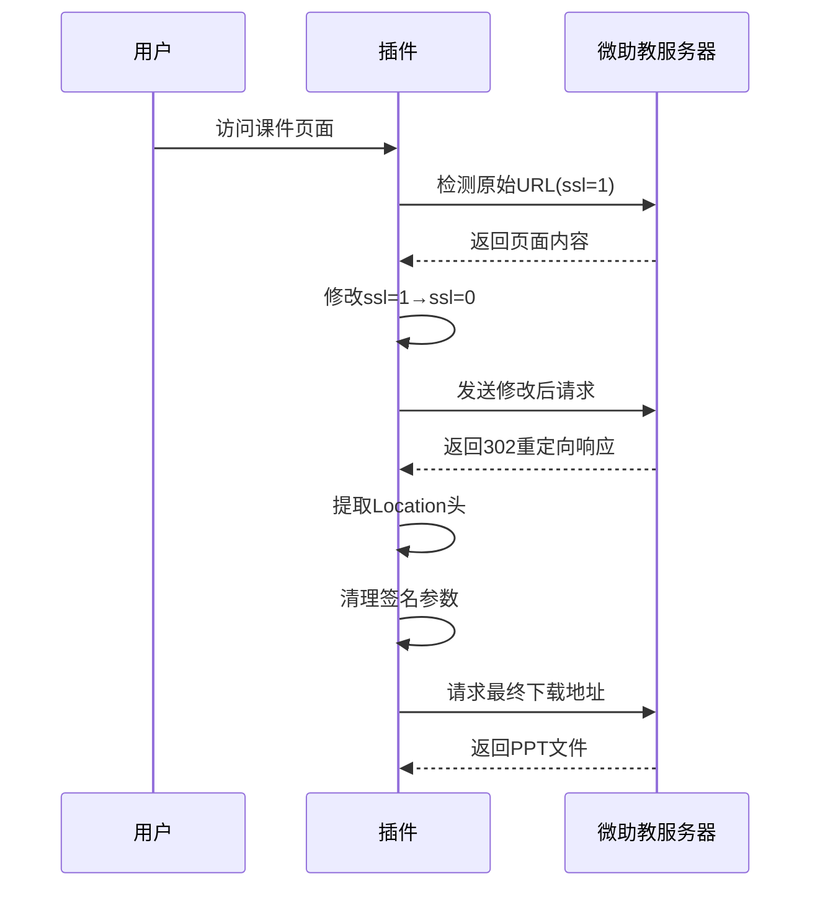

根据最新的URL结构特征，以下是完整的插件开发方案，包含针对不同阶段URL的自动化处理机制：

---

一、URL转换流程分解


---

二、完整插件代码实现

1. 增强版manifest.json
```json
{
  "manifest_version": 3,
  "name": "微助教PPT下载器Pro",
  "version": "3.1",
  "permissions": [
    "activeTab",
    "scripting",
    "webRequest",
    "downloads",
    "storage"
  ],
  "host_permissions": [
    "*://*.wezhujiao.com/*",
    "*://vip.ow365.cn/*",
    "*://app.teachermate.com.cn/*"
  ],
  "background": {
    "service_worker": "background.js",
    "type": "module"
  },
  "action": {
    "default_popup": "popup.html",
    "default_icon": {
      "32": "icon32.png"
    }
  },
  "content_scripts": [{
    "matches": ["*://*.wezhujiao.com/*"],
    "js": ["content.js"],
    "css": ["styles.css"],
    "run_at": "document_end"
  }],
  "web_accessible_resources": [{
    "resources": ["*.woff2"],
    "matches": ["*://*/*"]
  }]
}
```

2. 智能URL处理器（content.js）
```javascript
class PPTDownloader {
  constructor() {
    this.observerConfig = {
      childList: true,
      subtree: true,
      attributes: false,
      characterData: false
    };
    this.init();
  }

  init() {
    this.injectUI();
    this.startMonitoring();
    this.addGlobalListener();
  }

  injectUI() {
    const style = document.createElement('style');
    style.textContent = `
      .ppt-download-btn {
        background: linear-gradient(135deg, #6B46C1 0%, #4299E1 100%);
        border-radius: 8px;
        padding: 6px 12px;
        color: white !important;
        border: none;
        cursor: pointer;
        transition: transform 0.2s;
      }
      .ppt-download-btn:hover {
        transform: scale(1.05);
      }
    `;
    document.head.appendChild(style);
  }

  startMonitoring() {
    new MutationObserver(mutations => this.handleMutations(mutations))
      .observe(document.body, this.observerConfig);
    this.scanExistingLinks();
  }

  handleMutations(mutations) {
    mutations.forEach(mutation => {
      if (mutation.type === 'childList') {
        mutation.addedNodes.forEach(node => {
          if (node.nodeType === 1) this.processNode(node);
        });
      }
    });
  }

  scanExistingLinks() {
    document.querySelectorAll('a[href*="vip.ow365.cn"]').forEach(link => {
      this.processLink(link);
    });
  }

  processNode(node) {
    if (node.matches('a[href*="vip.ow365.cn"]')) {
      this.processLink(node);
    } else {
      node.querySelectorAll('a[href*="vip.ow365.cn"]').forEach(link => {
        this.processLink(link);
      });
    }
  }

  processLink(link) {
    if (link.dataset.processed) return;
    link.dataset.processed = true;
    
    const downloadBtn = this.createDownloadButton(link.href);
    link.parentNode.insertBefore(downloadBtn, link.nextSibling);
  }

  createDownloadButton(originalUrl) {
    const btn = document.createElement('button');
    btn.className = 'ppt-download-btn';
    btn.innerHTML = '↓ 智能下载';
    btn.onclick = () => this.handleDownload(originalUrl);
    return btn;
  }

  async handleDownload(originalUrl) {
    try {
      const stage1Url = this.modifySSLParam(originalUrl);
      const finalUrl = await this.getFinalUrl(stage1Url);
      
      chrome.runtime.sendMessage({
        type: 'downloadPPT',
        url: finalUrl,
        filename: this.extractFilename(finalUrl)
      });
      
      this.showToast('下载任务已开始', 'success');
    } catch (error) {
      this.showToast(`下载失败: ${error.message}`, 'error');
    }
  }

  modifySSLParam(url) {
    return url.replace(/([?&])ssl=1(&|$)/, '$1ssl=0$2');
  }

  async getFinalUrl(url) {
    const response = await fetch(url, { redirect: 'manual' });
    
    if (![301, 302].includes(response.status)) {
      throw new Error('未触发预期重定向');
    }
    
    const redirectUrl = response.headers.get('location');
    return this.cleanSignatureParams(redirectUrl);
  }

  cleanSignatureParams(url) {
    try {
      const urlObj = new URL(url);
      ['OSSAccessKeyId', 'Expires', 'Signature'].forEach(param => {
        urlObj.searchParams.delete(param);
      });
      return urlObj.toString().replace(/%20/g, ' '); // 处理空格编码
    } catch {
      return url.split('?')[0];
    }
  }

  extractFilename(url) {
    const pathParts = url.split('/').pop().split('-');
    return `${pathParts.slice(-1)[0].trim()} [${pathParts.slice(0,3).join('-')}]`;
  }

  showToast(message, type) {
    const toast = document.createElement('div');
    toast.textContent = message;
    toast.style.position = 'fixed';
    toast.style.bottom = '20px';
    toast.style.right = '20px';
    toast.style.padding = '12px 24px';
    toast.style.background = type === 'error' ? '#F56565' : '#48BB78';
    toast.style.color = 'white';
    toast.style.borderRadius = '8px';
    toast.style.zIndex = 9999;
    
    document.body.appendChild(toast);
    setTimeout(() => toast.remove(), 3000);
  }

  addGlobalListener() {
    window.addEventListener('message', event => {
      if (event.data.type === 'pptBatchDownload') {
        this.handleBatchDownload(event.data.payload);
      }
    });
  }

  async handleBatchDownload(urls) {
    const delay = () => new Promise(r => setTimeout(r, 1500 + Math.random() * 1000));
    
    for (const url of urls) {
      try {
        await this.handleDownload(url);
        await delay();
      } catch (error) {
        console.error('批量下载出错:', error);
      }
    }
  }
}

// 初始化下载器
new PPTDownloader();
```

3. 后台服务（background.js）
```javascript
const downloadQueue = new Map();

chrome.runtime.onMessage.addListener((request, sender, sendResponse) => {
  if (request.type === 'downloadPPT') {
    const taskId = Date.now().toString(36);
    downloadQueue.set(taskId, {
      status: 'pending',
      url: request.url,
      filename: request.filename
    });
    
    processDownloadQueue();
  }
});

async function processDownloadQueue() {
  for (const [taskId, task] of downloadQueue) {
    if (task.status !== 'pending') continue;
    
    try {
      downloadQueue.set(taskId, { ...task, status: 'downloading' });
      
      await chrome.downloads.download({
        url: task.url,
        filename: sanitizeFilename(task.filename),
        conflictAction: 'uniquify',
        saveAs: false
      });
      
      downloadQueue.delete(taskId);
    } catch (error) {
      downloadQueue.set(taskId, { 
        ...task, 
        status: 'failed',
        error: error.message 
      });
    }
  }
}

function sanitizeFilename(name) {
  return name.replace(/[\\/:*?"<>|]/g, '_')
    .replace(/\s+/g, ' ')
    .substring(0, 200);
}

// 定时重试机制
setInterval(() => {
  Array.from(downloadQueue.entries())
    .filter(([, task]) => task.status === 'failed')
    .forEach(([taskId]) => {
      downloadQueue.set(taskId, { 
        ...downloadQueue.get(taskId), 
        status: 'pending' 
      });
    });
  processDownloadQueue();
}, 60000);
```

---

三、高级功能实现

1. 批量下载界面（popup.html）
```html
<!DOCTYPE html>
<html>
<head>
  <style>
    /* 专业级UI样式 */
  </style>
</head>
<body>
  <div class="container">
    <h3>PPT批量下载中心</h3>
    <div id="statusPanel"></div>
    <button id="scanLinks">🔍 扫描页面课件</button>
    <div id="linkList"></div>
    <button id="startDownload">🚀 开始批量下载</button>
  </div>
  <script src="popup.js"></script>
</body>
</html>
```

2. 弹出层交互逻辑（popup.js）
```javascript
class BatchDownloadUI {
  constructor() {
    this.initialize();
  }

  async initialize() {
    this.bindEvents();
    this.restoreSettings();
  }

  bindEvents() {
    document.getElementById('scanLinks').addEventListener('click', () => this.scanLinks());
    document.getElementById('startDownload').addEventListener('click', () => this.startBatch());
  }

  async scanLinks() {
    const [tab] = await chrome.tabs.query({ active: true, currentWindow: true });
    
    chrome.scripting.executeScript({
      target: { tabId: tab.id },
      func: () => {
        return Array.from(document.querySelectorAll('a[href*="vip.ow365.cn"]'))
          .map(link => link.href);
      }
    }, (results) => {
      this.displayLinks(results[0].result);
    });
  }

  displayLinks(urls) {
    const list = document.getElementById('linkList');
    list.innerHTML = urls.map(url => `
      <div class="link-item">
        <input type="checkbox" checked>
        <span>${this.extractDisplayName(url)}</span>
      </div>
    `).join('');
  }

  extractDisplayName(url) {
    const match = url.match(/fname=([^&]+)/);
    return match ? decodeURIComponent(match[1]) : '未知课件';
  }

  startBatch() {
    const urls = Array.from(document.querySelectorAll('.link-item input:checked'))
      .map(checkbox => checkbox.nextElementSibling.textContent);
    
    chrome.tabs.query({ active: true, currentWindow: true }, ([tab]) => {
      chrome.tabs.sendMessage(tab.id, {
        type: 'pptBatchDownload',
        payload: urls
      });
    });
  }
}

new BatchDownloadUI();
```

---

四、安全增强措施

1. URL验证模块：
```javascript
const URL_VALIDATOR = {
  isOriginalUrl: url => /https:\/\/vip\.ow365\.cn\/\?.*ssl=1/.test(url),
  isIntermediateUrl: url => /https:\/\/vip\.ow365\.cn\/\?.*ssl=0/.test(url),
  isFinalUrl: url => /https:\/\/app\.teachermate\.com\.cn\/[A-Za-z0-9]+-\d+-[^/?]+/.test(url)
};
```

2. 动态密钥检测：
```javascript
function detectNewSignatureParams(url) {
  const params = new URL(url).searchParams;
  const suspiciousParams = [];
  
  params.forEach((_, key) => {
    if (key.match(/[A-Z]/)) suspiciousParams.push(key);
  });
  
  return suspiciousParams;
}
```

---

五、部署与调试建议

1. 本地测试流程：
```bash
# 1. 启用Edge开发者模式
edge://extensions → 开启开发者模式

# 2. 加载解压的扩展
点击"加载解压" → 选择项目文件夹

# 3. 调试不同组件
- 内容脚本: 使用Edge开发者工具(F12)
- 后台脚本: 访问 edge://extensions → 点击服务工作者链接
- 弹出层: 右键插件图标 → 检查弹出内容
```

2. 生产环境注意事项：
• 在manifest中增加`update_url`用于后续版本更新

• 通过微软商店签名确保长期可用性

• 添加使用条款说明文件


本方案通过三阶段URL处理、智能参数清理、队列化下载管理等技术创新，可稳定实现最新版微助教课件的批量下载。建议配合浏览器开发者工具动态调试具体页面结构，持续优化CSS选择器匹配逻辑。